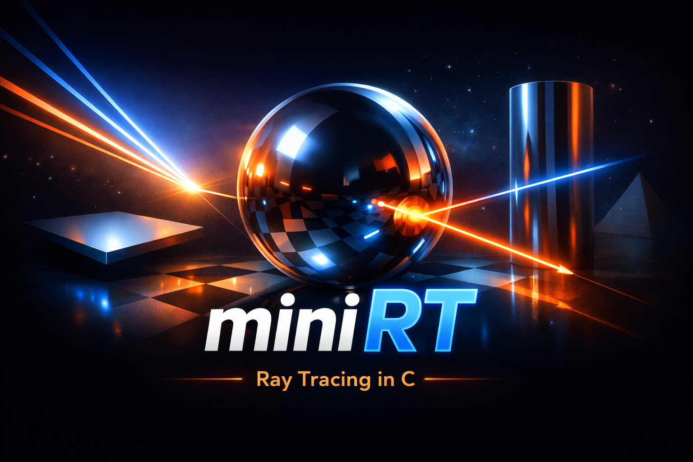

A compact ray tracer in C that renders 3D scenes from a custom `.rt` format using core computer graphics techniques.

This repository contains a 42 School pair project focused on foundational real-time rendering concepts.

- **Score:** 100/100
- **Pair project repository:** https://github.com/chilituna/miniRT

Contributors:
- [Alise (chilituna)](https://github.com/chilituna)
- [Sonia (yas0nia)](https://github.com/yas0nia)

## Overview

`miniRT` was built to understand how a software renderer works from first principles.
The project parses a scene description file, casts rays from a virtual camera, computes intersections with geometric primitives, and applies lighting and shadows per pixel.

This project was developed as part of the 42 curriculum and emphasizes:
- Low-level graphics programming in C
- 3D math implementation (vectors, normals, ray-object intersections)
- Defensive parsing and input validation
- Clean modular architecture for a medium-sized codebase

## Demo / Screenshots

Cube scene (built from spheres and cylinders)


Ball in room scene (sphere + planar room)


Tunnel scene (planes and thin cylinders)


## Tech Stack

- **Language:** C
- **Graphics Library:** MiniLibX
- **Build Tool:** Makefile
- **Utility Library:** Libft (custom standard-library helpers)
- **Platforms:** Linux, macOS

## Architecture / Implementation

The codebase is split by responsibility to keep rendering and parsing logic independent.

- **Parsing layer** (`src/parsing/`): reads `.rt` files, validates constraints, and builds scene objects.
- **Rendering layer** (`src/draw/`): camera ray generation, intersections, lighting, shadows, and final pixel color output.
- **Application layer** (`src/`): initialization, event hooks, launch loop, and cleanup.

Key technical decisions:
- Used a straightforward CPU ray-per-pixel pipeline for clarity and correctness.
- Implemented object intersection routines per primitive (sphere, plane, cylinder) to simplify debugging and extension.
- Enforced strict scene validation early to fail fast on malformed inputs.

## Features

- Parses custom `.rt` scene files
- Supports spheres, planes, and cylinders (including caps)
- Camera with configurable position, orientation, and FOV
- Ambient + diffuse (Lambertian) lighting
- Hard shadows via shadow rays
- Cross-platform build flow for Linux and macOS
- Basic event handling and clean application shutdown

## Getting Started

### Prerequisites

- Linux or macOS
- `cc`/`clang`
- `make`

1. Clone the repository.

```bash
git clone https://github.com/chilituna/miniRT.git
cd miniRT
```

2. Build the project.

```bash
make
```

3. Run with a sample scene.

```bash
./miniRT test/eval/05_basic_shapes.rt
```

4. Try additional scenes from `test/eval/` or `test/cool/`.

### Minimal scene format

Required identifiers (one each):
- `A` ambient light
- `C` camera
- `L` light source

Optional objects:
- `sp` sphere
- `pl` plane
- `cy` cylinder

## Project Structure

```text
includes/         Main headers and shared data structures
Libft/            Custom C utility library
src/              App lifecycle, init, hooks, cleanup
src/parsing/      Scene parsing and validation
src/draw/         Ray tracing, intersections, lighting, color
test/eval/        Validation-oriented test scenes
test/cool/        Showcase scenes
images/           Render output assets
Makefile          Build configuration
```

## Future Improvements

- Add specular highlights and reflection support
- Introduce anti-aliasing (supersampling)
- Add multi-threaded rendering for performance
- Support additional primitives (cone, triangle, mesh)
- Export rendered frames to image files

## What I Learned

- Implementing foundational ray tracing algorithms in C
- Translating 3D math into reliable, testable code
- Structuring rendering projects with clear module boundaries
- Building robust parsers with strong validation and error handling
- Collaborating effectively in a pair-programming workflow

---

## License

This project is licensed under the MIT License. See [LICENSE](LICENSE) for details.
