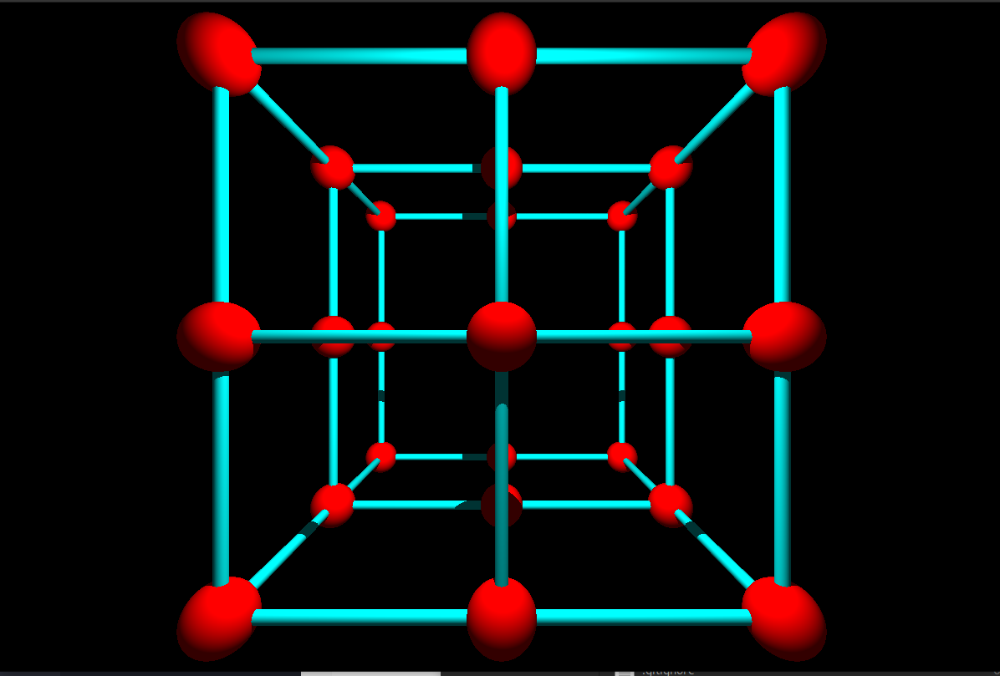
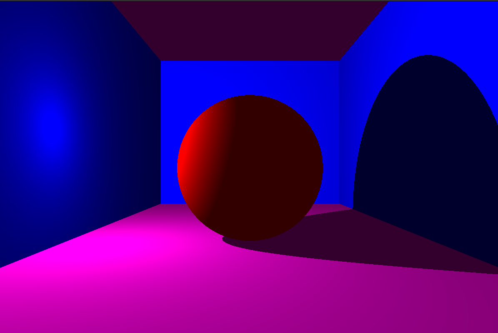
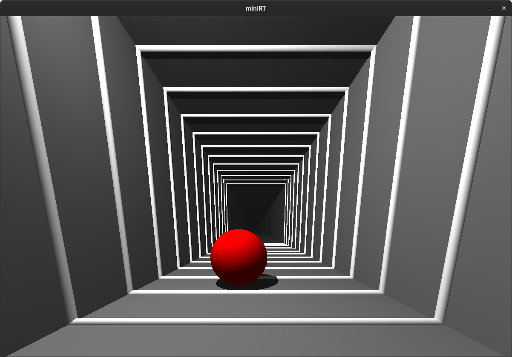

# miniRT

A lightweight ray tracer written in C, built as part of the 42 Core Curriculum.

This was a **collaborative 2-person project**, developed through pair programming, shared design decisions, and coordinated implementation.

`miniRT` renders 3D scenes from a textual `.rt` description using fundamental ray tracing techniques (camera rays, intersections, normals, lighting, and shadows).

Project result: **100/100**

## Why This Project

This project demonstrates practical engineering skills that transfer directly to real-world software roles:

- Building a non-trivial graphics application in **C** from scratch
- Translating mathematical concepts into maintainable, production-style code
- Designing robust input parsing and validation with meaningful error handling
- Working with low-level rendering pipelines and platform-specific window/event systems

## Features

- Scene parsing from `.rt` files
- Supported objects:
	- Sphere (`sp`)
	- Plane (`pl`)
	- Cylinder (`cy`, including caps)
- Lighting model:
	- Ambient light
	- Diffuse (Lambertian) shading
	- Hard shadows via shadow rays
- Camera setup with configurable position, orientation, and field of view
- Basic window/event handling with MiniLibX (`ESC` to exit)
- Strict input validation (ranges, duplicates, required scene elements)

## Render Previews

Cube (built from spheres and cylinders)


Sphere in a room (planes)


Sphere in a tunnel (planes + thin cylinders)


## Tech Stack

- Language: `C`
- Graphics library: `MiniLibX`
- Build system: `Makefile`
- Utility library: custom `Libft`
- Platforms: Linux and macOS (separate MiniLibX handling in build)

## Project Structure

```text
includes/        Header files and shared types
src/parsing/     Scene lexer/parser and input validation
src/draw/        Ray generation, intersections, lighting, color
src/             App lifecycle, hooks, initialization, cleanup
test/            Example and evaluation scenes
images/          Render screenshots
```

## Build and Run

### 1. Clone the repository

```bash
git clone https://github.com/chilituna/miniRT.git
cd miniRT
```

### 2. Compile

```bash
make
```

Notes:
- On Linux, the Makefile automatically clones `minilibx-linux` if missing.
- On macOS, the Makefile downloads and extracts the MiniLibX archive if missing.

### 3. Run

```bash
./miniRT test/eval/05_basic_shapes.rt
```

## Scene File Format (`.rt`)

Required (exactly one each):

- `A` ambient light
- `C` camera
- `L` light source

Optional (zero or more):

- `sp` sphere
- `pl` plane
- `cy` cylinder

Minimal example:

```text
A 0.2 255,255,255
C 0,0,80 0,0,-1 50
L -40,0,30 0.7

sp 0,0,0 20 255,0,0
pl 0,-10,0 0,1,0 0,0,225
cy 20,0,5 0,1,0 10 30 0,255,0
```

## What I Learned

- Implementing geometric intersection algorithms for multiple primitives
- Building a per-pixel rendering loop with a clean data flow
- Debugging floating-point and precision issues in 3D math
- Designing parser code that fails fast and reports actionable errors
- Organizing a medium-sized C project for readability and maintainability

## Useful References

- Ray Tracing in One Weekend: foundational concepts for rays, intersections, and materials.
	https://raytracing.github.io/books/RayTracingInOneWeekend.html
- The Cherno graphics programming series: practical intuition for math-heavy rendering topics.
	https://www.youtube.com/playlist?list=PLlrATfBNZ98edc5GshdBtREv5asFW3yXl
- Intro-to-graphics video series used to reinforce lighting and camera fundamentals.
	https://www.youtube.com/playlist?list=PLAqGIYgEAxrUO6ODA0pnLkM2UOijerFPv
